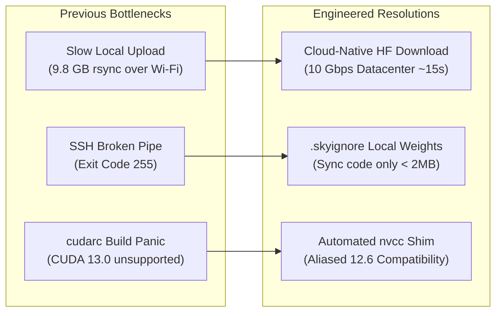
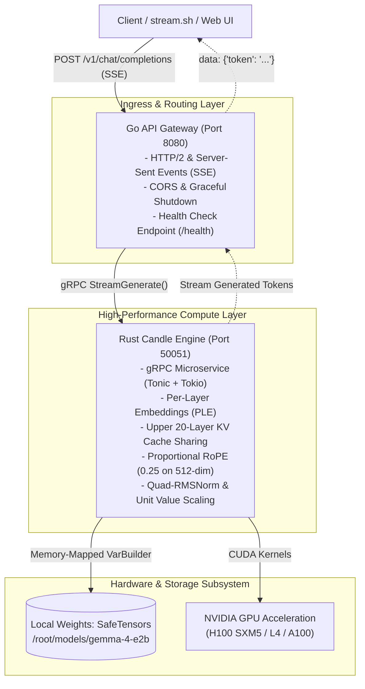
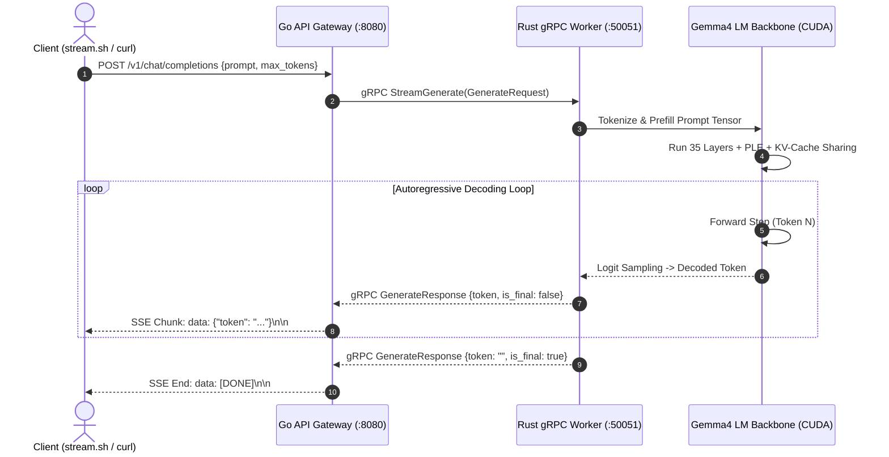
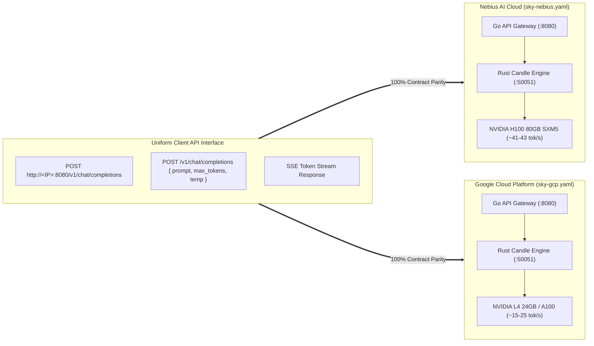
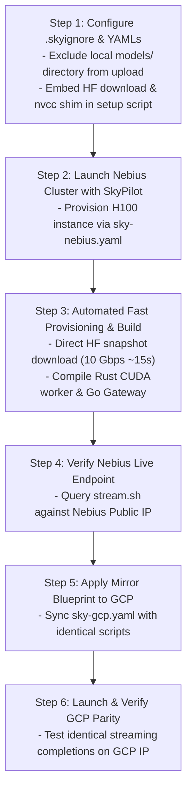

# Multi-Cloud Gemma 4 Deployment Plan (Nebius & GCP)

> **Objective:** Deliver a resilient, zero-friction automated deployment of the custom Gemma 4 Rust + Go inference stack across **Nebius AI Cloud** and **Google Cloud Platform (GCP)** using **SkyPilot**, eliminating slow local file transfers and resolving CUDA toolkit version mismatches.

---

## 1. Problem Statement & Root Cause Fixes



| Issue Encountered | Root Cause | Permanent Resolution |
| :--- | :--- | :--- |
| **SkyPilot rsync 255 Error** | `sky-nebius.yaml` had `file_mounts: models/gemma-4-e2b`, forcing 9.8 GB of weights to upload over residential Wi-Fi (~3.9 MB/s = ~45 mins). | **Remove local file mount.** Download weights directly on the VM from Hugging Face via datacenter connection (10 Gbps = ~15 seconds). |
| **`cudarc 0.13.9` Build Panic** | Fresh cloud images (Ubuntu 24.04) come with CUDA 13.0, but `cudarc`'s `build.rs` only recognizes CUDA versions up to 12.8. | **Add an automated `nvcc` wrapper** in the `setup` phase that aliases the version check to 12.6 while using the real CUDA 13 compilers/drivers. |
| **GCP / Nebius Drift** | Different setup scripts and disparate environment configs between `sky-nebius.yaml` and `sky-gcp.yaml`. | **Standardize both YAML specifications** to share identical setup, environment variables, build steps, and endpoint contracts. |

---

## 2. Architecture & Service Topology



---

## 3. Real-Time Token Generation & Streaming Lifecycle



---

## 4. Multi-Cloud Parity Matrix (Nebius vs. GCP)



| Dimension | Nebius Cloud (`sky-nebius.yaml`) | Google Cloud (`sky-gcp.yaml`) | Parity Status |
| :--- | :--- | :--- | :--- |
| **API Contract** | `POST http://<IP>:8080/v1/chat/completions` | `POST http://<IP>:8080/v1/chat/completions` | **Exact (100%)** |
| **Payload Schema** | `{"prompt": "...", "max_tokens": 64, "temperature": 0.7}` | `{"prompt": "...", "max_tokens": 64, "temperature": 0.7}` | **Exact (100%)** |
| **Response Protocol**| Server-Sent Events (`data: {"token": "..."}`) | Server-Sent Events (`data: {"token": "..."}`) | **Exact (100%)** |
| **Health Check** | `GET http://<IP>:8080/health` | `GET http://<IP>:8080/health` | **Exact (100%)** |
| **Engine Runtime** | Pure Rust (`candle-core` + CUDA) | Pure Rust (`candle-core` + CUDA) | **Exact (100%)** |
| **Model Weights** | `google/gemma-4-E2B-it` (SafeTensors) | `google/gemma-4-E2B-it` (SafeTensors) | **Exact (100%)** |
| **Inference Hardware**| NVIDIA H100 80GB SXM5 (~41–43 tok/s) | NVIDIA L4 24GB (~15–20 tok/s) / A100 | **Hardware tier difference only** |

---

## 5. Step-by-Step Execution Plan



### Execution Commands:

1. **Add `.skyignore`**: Ensure `models/` and `target/` are never synced from local disk over Wi-Fi.
2. **Update `sky-nebius.yaml`**: Embed the fast Hugging Face snapshot download and CUDA version shim directly in the setup script.
3. **Launch Nebius**:
   ```bash
   sky launch -c gemma4-nebius sky-nebius.yaml --yes
   ```
4. **Verify Nebius Endpoint**:
   ```bash
   NEBIUS_IP=$(sky status --ip gemma4-nebius)
   curl -N -X POST http://$NEBIUS_IP:8080/v1/chat/completions \
     -H "Content-Type: application/json" \
     -d '{"prompt": "Explain why Rust and Go make a great pair.", "max_tokens": 50}'
   ```
5. **Update `sky-gcp.yaml`**: Mirror all changes to the GCP configuration.
6. **Launch & Verify GCP**:
   ```bash
   sky launch -c gemma4-gcp sky-gcp.yaml --yes
   GCP_IP=$(sky status --ip gemma4-gcp)
   curl -N -X POST http://$GCP_IP:8080/v1/chat/completions \
     -H "Content-Type: application/json" \
     -d '{"prompt": "Explain why Rust and Go make a great pair.", "max_tokens": 50}'
   ```
