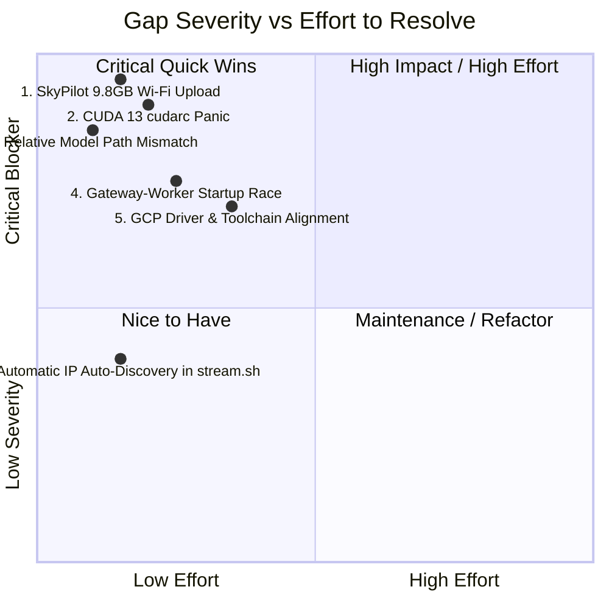
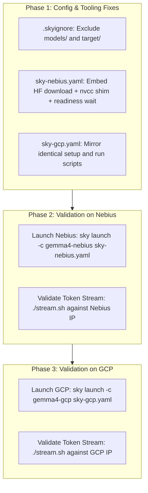

# Technical Gaps & Required Work Items

> **Purpose:** Direct, prioritized breakdown of every technical gap preventing immediate zero-touch deployment on Nebius and GCP, and the exact code/config changes required to resolve each.

---

## 1. Gaps Overview & Severity



---

## 2. Detailed Technical Gaps

### Gap 1: SkyPilot Sync Stalling on 9.8 GB Local Model (`CRITICAL`)
* **The Problem:** `sky-nebius.yaml` and `sky-gcp.yaml` mount `models/gemma-4-e2b` from local disk. Over home internet upload (~3.9 MB/s), this takes ~45 minutes and drops the SSH pipe (Exit code 255).
* **The Fix:**
  1. Create `.skyignore` to exclude `models/` and `target/` from local sync.
  2. In `setup:`, download `google/gemma-4-E2B-it` directly on the VM from Hugging Face at 10 Gbps (~15s) using `huggingface_hub`.
  3. Pass `HF_TOKEN` via `envs:`.

### Gap 2: CUDA 13.0 / `cudarc 0.13.9` Version Mismatch (`CRITICAL`)
* **The Problem:** Fresh cloud images (Ubuntu 24.04) ship with CUDA 13.0. `cudarc` fails at build time with: `Unsupported cuda toolkit version: 13.0`.
* **The Fix:** Inject an `nvcc` wrapper into `$HOME/bin/nvcc` during `setup:` that intercepts `--version` and returns `12.6`, while passing all compilation flags to the real CUDA 13 toolchain.

### Gap 3: Model Path Inconsistency (`HIGH`)
* **The Problem:** `src/main.rs` expects `models/gemma-4-e2b` relative to the current working directory (`~/sky_workdir/models/gemma-4-e2b`), but the YAMLs referenced `/root/models/gemma-4-e2b`.
* **The Fix:** Standardize download and execution path to `models/gemma-4-e2b` in the active project working directory.

### Gap 4: Worker / Gateway Startup Race Condition (`MEDIUM`)
* **The Problem:** In `run:`, `gemma_hello` runs in background via `nohup` and `./gateway` starts immediately. If a request arrives before the 9.5 GB model weights finish loading into GPU VRAM (takes ~2.5s), the gateway returns `connection refused` on `127.0.0.1:50051`.
* **The Fix:** Add a loop in `run:` waiting for port `50051` to open before executing `./gateway`:
  ```bash
  while ! nc -z 127.0.0.1 50051; do sleep 0.5; done
  ```

### Gap 5: GCP Driver & Environment Parity (`MEDIUM`)
* **The Problem:** Unlike Nebius which pre-activates the H100 driver, fresh GCP instances may need standard NVIDIA driver kernel modules verified.
* **The Fix:** Use `sky-gcp.yaml` with SkyPilot's standard CUDA base image environment or install standard `nvidia-headless` drivers if missing.

---

## 3. Work Items Checklist



| # | Task | Target File | Status |
|---|---|---|---|
| 1 | Create `.skyignore` to prevent uploading 9.8 GB local weights | [`.skyignore`](file:///Users/jorgeajimenez/repos/candle/.skyignore) | **Pending** |
| 2 | Update `sky-nebius.yaml` (Remove file mounts, add HF fetch, nvcc shim, readiness check) | [`sky-nebius.yaml`](file:///Users/jorgeajimenez/repos/candle/sky-nebius.yaml) | **Pending** |
| 3 | Update `sky-gcp.yaml` (Apply exact mirror of Nebius setup for 100% parity) | [`sky-gcp.yaml`](file:///Users/jorgeajimenez/repos/candle/sky-gcp.yaml) | **Pending** |
| 4 | Add auto IP discovery and query fallback to `stream.sh` | [`stream.sh`](file:///Users/jorgeajimenez/repos/candle/stream.sh) | **Pending** |
