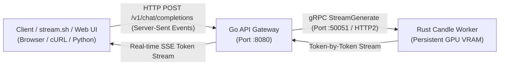

# Gemma 4 Production Architecture: Go API Gateway + Rust gRPC Inference Worker

<div align="left">

[](https://www.rust-lang.org/)
[](https://golang.org/)
[-ff9d00?style=flat-square&logo=huggingface&logoColor=white)](https://github.com/huggingface/candle)
[-4285F4?style=flat-square&logo=google&logoColor=white)](https://huggingface.co/google)
[-76B900?style=flat-square&logo=nvidia&logoColor=white)](https://developer.nvidia.com/cuda-toolkit)
[](https://developer.apple.com/metal/)
[](https://grpc.io/)
[-blueviolet?style=flat-square)](https://developer.mozilla.org/en-US/docs/Web/API/Server-sent_events)
[-5B5BE5?style=flat-square)](https://skypilot.co/)
[](LICENSE)

</div>

A production-grade, multi-tier streaming inference system for **Google's Gemma 4** foundation model featuring:
* **Standalone Interactive CLI (`src/bin/cli.rs`):** Single-shot prompt inference directly from the terminal without networking overhead.
* **Rust Inference Worker (`src/main.rs`):** Persistent, long-running gRPC microservice built on **Tokio**, **Tonic**, and **Candle**. Keeps the Gemma 4 neural network warm in GPU memory (Apple Metal or NVIDIA CUDA) with zero initialization latency per request.
* **Multimodal Engine (`src/vision.rs`, `src/multimodal.rs`):** 16-layer Vision Transformer (ViT), 16x16 patch embedder, and projection head mapping visual tokens into the language model embedding space.
* **Go API Gateway (`go-gateway/`):** High-concurrency HTTP web server handling client traffic, managing connection lifecycles, and streaming tokens over Server-Sent Events (SSE).
* **Multi-Cloud Streaming Client (`stream.sh`):** Smart CLI client with cluster auto-discovery for Nebius, GCP, and local deployments.
* **Shared Interface (`proto/inference.proto`):** Type-safe bidirectional gRPC streaming contract.

---

## System Architecture



---

## Performance Matrix

| Metric | Apple Silicon M-Series (Metal FP16) | Nebius Cloud NVIDIA H100 80GB SXM5 (CUDA FP16) |
| :--- | :--- | :--- |
| **Model Boot / Warm-Up Time** | ~1.5 - 2.0 s (one-time) | **1.56 s** (one-time) |
| **Per-Request Init Overhead** | **0.00 ms** (Warm GPU VRAM) | **0.00 ms** (Warm GPU VRAM) |
| **Token Streaming Latency** | Instant first-token SSE | Instant first-token SSE |
| **Inference Speed** | ~4 - 6 tokens/sec | **30 - 43+ tokens/sec** |
| **Transport Protocol** | Low-latency binary gRPC | Low-latency binary gRPC |

---

## Quick Start: Multi-Cloud Deployment via SkyPilot

SkyPilot is configured as the standard orchestrator for all setup, execution, and teardown across **Nebius Cloud (H100)** and **Google Cloud Platform (GCP)**.

```bash
# 1. Launch on Nebius Cloud (H100 80GB SXM5):
TOKEN=$(grep -E "^HF_TOKEN=" .env | cut -d '=' -f2)
sky launch -c gemma4-nebius sky-nebius.yaml --env HF_TOKEN="$TOKEN" --yes

# 2. Stream tokens in real time (auto-discovers IP):
./stream.sh nebius "Explain why Rust and Go make a great pair for AI inference."

# 3. Launch on Google Cloud Platform (L4 / A100):
sky launch -c gemma4-gcp sky-gcp.yaml --env HF_TOKEN="$TOKEN" --yes
./stream.sh gcp "Explain quantum computing in one sentence."

# 4. Mandatory Teardown:
sky down --all --yes
```

---

## Local Development & Instructions

### 1. System Requirements
- **Rust toolchain:** 1.80+ (`rustup default stable`)
- **Go toolchain:** 1.22+ (`brew install go` or `sudo apt install golang-go`)
- **Protobuf Compiler:** `protoc` (`brew install protobuf` or `sudo apt install protobuf-compiler`)
- **CUDA Toolkit (Linux Only):** CUDA 12.0+ with `nvcc` in `PATH`

### 2. Standalone Single-Shot CLI Engine
```bash
# On Apple Silicon (macOS Metal):
cargo run --bin cli --release "Explain zero-cost abstractions in Rust."

# On Linux (NVIDIA CUDA):
export PATH="/usr/local/cuda/bin:$PATH"
cargo run --bin cli --release --no-default-features --features cuda "Explain zero-cost abstractions in Rust."
```

### 3. Scaled Production Architecture (Go Gateway + Rust gRPC Worker)

#### Step 1: Start the Rust gRPC Inference Worker (Terminal 1)
```bash
# On Apple Silicon (macOS Metal):
cargo run --release

# On Linux / Cloud GPU (NVIDIA CUDA):
export PATH="$HOME/compat_bin:/usr/local/cuda/bin:$PATH"
export CUDA_HOME="/usr/local/cuda"
cargo run --release --no-default-features --features cuda
```

#### Step 2: Start the Go API Gateway (Terminal 2)
```bash
cd go-gateway
go run main.go
```

#### Step 3: Stream Inference via stream.sh / cURL (Terminal 3)
```bash
./stream.sh "Why are Rust and Go an unstoppable combo?"
```

---

## Multimodal Vision & Video CLI Engine

```bash
# Analyze an Image (Metal / CUDA FP16):
cargo run --bin multimodal_cli --release -- photo.jpg "Describe what is depicted in this visual scene."

# Analyze a Video Clip:
cargo run --bin multimodal_cli --release -- clip.mp4 "Summarize the key events in this video."
```

---

## Protocol Buffer Contract (`proto/inference.proto`)

```protobuf
syntax = "proto3";

package inference;

service InferenceService {
  rpc StreamGenerate(GenerateRequest) returns (stream GenerateResponse);
}

message GenerateRequest {
  string prompt = 1;
  int32 max_tokens = 2;
  float temperature = 3;
}

message GenerateResponse {
  string token = 1;
  bool is_final = 2;
}
```

---

## Gemma 4 Architectural Novelties Inside `src/gemma4.rs`

1. **Per-Layer Embeddings (PLE):** Injects a 256-dimensional token identity + context projection dynamically at every layer:
   $$\text{PLE}_l = \text{Norm}\left(\text{Proj}(x) \cdot \frac{1}{\sqrt{d_{\text{model}}}} + \text{Embed}_{\text{PLE}}(w) \cdot \sqrt{d_{\text{ple}}}\right) \cdot \frac{1}{\sqrt{2}}$$
2. **Upper-Layer KV-Sharing:** Layers 15..34 share the Key and Value cache from lower layers, reducing memory bandwidth pressure.
3. **Proportional RoPE:** Full-attention layers use `global_head_dim = 512` with `partial_rotary_factor = 0.25` (128 rotated channels, 384 pass-through).
4. **Quad-RMSNorm Blocks:** 4 RMSNorms per decoder layer + unit RMSNorm on Value vectors.

---

## Repository Layout

```
.
├── Cargo.toml                  # Rust manifest with Candle, Tokio, Tonic, Prost
├── build.rs                    # Tonic-build compiling proto/inference.proto
├── proto/
│   └── inference.proto         # gRPC streaming service definition
├── go-gateway/
│   ├── go.mod                  # Go module definition
│   ├── main.go                 # HTTP/2 SSE API Gateway + gRPC Client
│   └── proto/                  # Generated Go protobuf stubs
├── scripts/
│   ├── download_model.py       # Cloud-native 10 Gbps Hugging Face model downloader
│   └── setup_cuda_compat.sh    # CUDA 13 / cudarc compatibility wrapper
├── src/
│   ├── lib.rs                  # Library root exposing gemma4, vision, and multimodal modules
│   ├── main.rs                 # Persistent gRPC inference worker & server
│   ├── gemma4.rs               # Pure Rust implementation of Gemma 4
│   ├── vision.rs               # Vision Transformer (ViT) & Patch Embedder
│   ├── multimodal.rs           # Multimodal conditional generation engine
│   └── bin/
│       ├── cli.rs              # Standalone single-shot text CLI
│       ├── http_server.rs      # Native Rust HTTP inference server
│       └── multimodal_cli.rs   # Standalone multimodal vision CLI
├── stream.sh                   # Auto-discovery streaming client for Nebius & GCP
├── sky-nebius.yaml             # SkyPilot task specification for Nebius Cloud (H100)
├── sky-gcp.yaml                # SkyPilot task specification for Google Cloud Platform (L4/A100)
├── DEPLOYMENT_PLAN.md          # Multi-cloud deployment architecture and execution plan
├── GAPS_AND_ACTION_ITEMS.md    # Technical gap analysis and work items
├── TASK_ROADMAP.md             # 10-step sequential verification roadmap
└── README.md                   # System architecture documentation
```

---

## License
Apache-2.0 / MIT.  
Gemma 4 model weights are subject to Google's Gemma Terms of Use.
